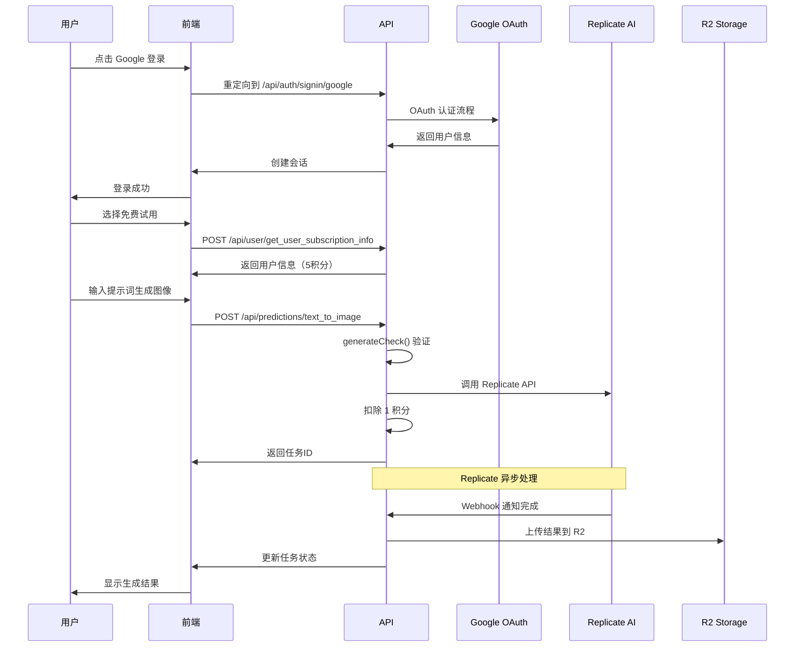
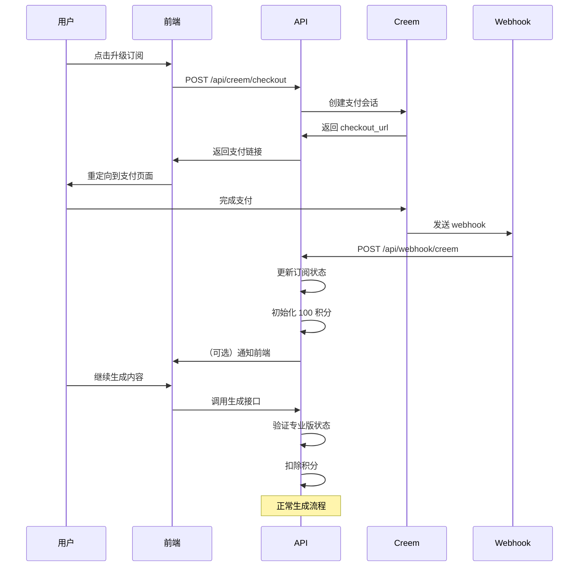
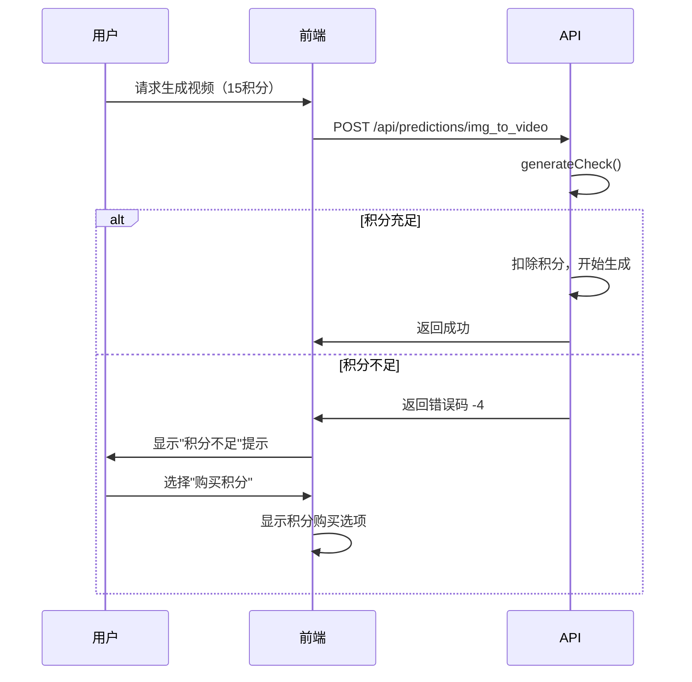
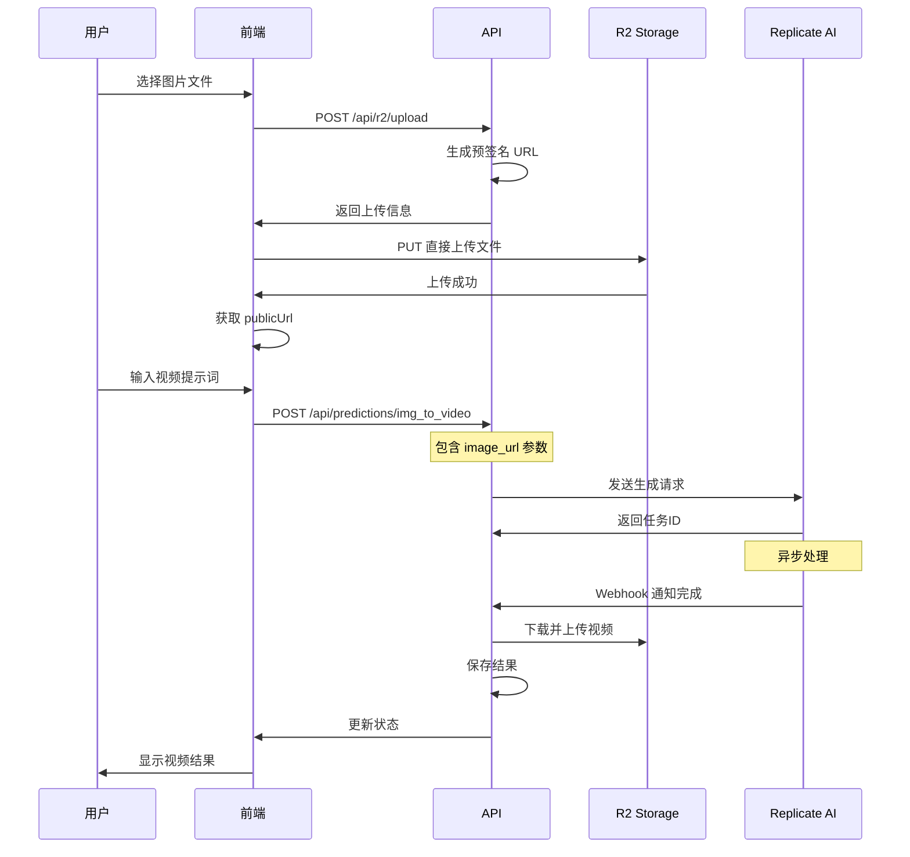

# AI 图像视频生成 API 文档

本文档提供了完整的 API 接口说明，包括所有接口的定义、参数、响应和业务流程。

## 目录

1. [认证接口](#认证接口)
2. [用户管理接口](#用户管理接口)
3. [订阅支付接口](#订阅支付接口)
4. [AI 生成接口](#ai-生成接口)
5. [文件管理接口](#文件管理接口)
6. [Webhook 接口](#webhook-接口)
7. [完整业务流程](#完整业务流程)

---

## 认证接口

### 1. Google OAuth 登录

**接口地址**: `/api/auth/[...nextauth]`

**功能**: Google OAuth 认证入口点

**使用方式**:
```javascript
// 前端重定向到 Google 登录
window.location.href = '/api/auth/signin/google';

// 登录成功后的回调
window.location.href = '/api/auth/callback/google';
```

**获取会话信息**:
```javascript
// 获取当前用户会话
const response = await fetch('/api/auth/session');
const session = await response.json();
```

**响应示例**:
```json
{
  "user": {
    "id": "uuid",
    "email": "user@example.com",
    "name": "User Name",
    "image": "https://..."
  },
  "expires": "2024-12-31T23:59:59.999Z"
}
```

### 2. 认证测试接口

**接口地址**: `/api/auth/test`

**功能**: 测试用户认证状态

**请求方法**: GET

**响应示例**:
```json
{
  "authenticated": true,
  "user": {
    "id": "uuid",
    "email": "user@example.com"
  }
}
```

---

## 用户管理接口

### 1. 检查用户专业版状态

**接口地址**: `/api/user/check_pro_status`

**功能**: 检查用户是否为专业版用户

**请求方法**: GET

**请求头**:
```
Authorization: Bearer <session_token>
```

**响应示例**:
```json
{
  "code": 0,
  "is_pro": true,
  "subscription": {
    "status": "active",
    "current_period_end": "2024-12-31T23:59:59.999Z"
  }
}
```

**错误码**:
- `0`: 成功
- `-1`: 用户未找到
- `-2`: 无订阅记录

### 2. 获取用户订阅信息

**接口地址**: `/api/user/get_user_subscription_info`

**功能**: 获取用户完整的订阅和积分信息

**请求方法**: GET

**请求头**:
```
Authorization: Bearer <session_token>
```

**响应示例**:
```json
{
  "code": 0,
  "user": {
    "id": "uuid",
    "email": "user@example.com",
    "name": "User Name"
  },
  "subscription": {
    "status": "active",
    "plan_name": "Monthly Pro",
    "current_period_start": "2024-12-01T00:00:00.000Z",
    "current_period_end": "2024-12-31T23:59:59.999Z"
  },
  "credit_usage": {
    "credits_total": 100,
    "credits_used": 25,
    "credits_remain": 75
  }
}
```

---

## 订阅支付接口

### 1. 创建 Creem 结账会话

**接口地址**: `/api/creem/checkout`

**功能**: 创建支付会话，重定向到 Creem 支付页面

**请求方法**: POST

**请求头**:
```
Content-Type: application/json
Authorization: Bearer <session_token>
```

**请求体**:
```json
{
  "plan_id": "monthly_pro",
  "amount": 999,
  "interval": "month",
  "user_uuid": "user-uuid",
  "user_email": "user@example.com"
}
```

**响应示例**:
```json
{
  "code": 0,
  "checkout_url": "https://pay.creem.io/checkout/session_xxx"
}
```

**使用流程**:
1. 前端调用此接口创建支付会话
2. 获取 checkout_url
3. 重定向用户到支付页面
4. 支付完成后通过 webhook 通知

---

## AI 生成接口

### 1. 文本生成图像

**接口地址**: `/api/predictions/text_to_image`

**功能**: 使用 AI 从文本描述生成图像

**请求方法**: POST

**请求头**:
```
Content-Type: application/json
Authorization: Bearer <session_token>
```

**请求体**:
```json
{
  "prompt": "A beautiful sunset over mountains",
  "user_id": "user-uuid",
  "user_email": "user@example.com",
  "credit": "1"
}
```

**内部处理流程**:
1. 调用 `generateCheck` 验证用户身份和积分
2. 检查订阅状态是否有效
3. 验证积分余额充足（需要 1 积分）
4. 调用 Replicate API 生成图像
5. 扣除用户积分
6. 返回生成任务 ID

**响应示例**:
```json
{
  "code": 0,
  "id": "pred_xxx",
  "status": "starting",
  "logs": [],
  "output": null,
  "error": null
}
```

**错误码**:
- `0`: 成功
- `-1`: 用户未认证
- `-2`: 积分未初始化
- `-3`: 无有效订阅
- `-4`: 积分不足

### 2. 图像生成视频

**接口地址**: `/api/predictions/img_to_video`

**功能**: 使用 AI 将静态图像转换为动态视频

**请求方法**: POST

**请求头**:
```
Content-Type: application/json
Authorization: Bearer <session_token>
```

**请求体**:
```json
{
  "prompt": "A bird flying in the sky",
  "image_url": "https://example.com/image.jpg",
  "user_id": "user-uuid",
  "user_email": "user@example.com",
  "credit": "15"
}
```

**内部处理流程**:
1. 调用 `generateCheck` 验证用户身份和积分
2. 检查订阅状态是否有效
3. 验证积分余额充足（需要 15 积分）
4. 调用 Replicate API 生成视频
5. 扣除用户积分
6. 返回生成任务 ID

**响应示例**:
```json
{
  "code": 0,
  "id": "pred_xxx",
  "status": "starting",
  "logs": [],
  "output": null,
  "error": null
}
```

### 3. 查询预测状态

**接口地址**: `/api/predictions/[id]`

**功能**: 查询 AI 生成任务的状态

**请求方法**: GET

**请求头**:
```
Authorization: Bearer <session_token>
```

**响应示例**:
```json
{
  "id": "pred_xxx",
  "status": "succeeded",
  "logs": ["Processing...", "Generating..."],
  "output": ["https://r2.bucket.com/generated_image.jpg"],
  "error": null,
  "created_at": "2024-12-01T10:00:00.000Z",
  "completed_at": "2024-12-01T10:05:00.000Z"
}
```

**状态说明**:
- `starting`: 任务开始
- `processing`: 处理中
- `succeeded`: 成功完成
- `failed`: 处理失败
- `canceled`: 已取消

---

## 文件管理接口

### 1. 上传文件到 R2

**接口地址**: `/api/r2/upload`

**功能**: 获取 R2 上传的预签名 URL

**请求方法**: POST

**请求头**:
```
Content-Type: application/json
Authorization: Bearer <session_token>
```

**请求体**:
```json
{
  "fileType": "image",
  "fileName": "upload.jpg",
  "contentType": "image/jpeg"
}
```

**响应示例**:
```json
{
  "code": 0,
  "presignedUrl": "https://bucket.r2.cloudflarestorage.com/ssat/image/uuid_upload.jpg?X-Amz-Algorithm=...",
  "objectKey": "ssat/image/uuid_upload.jpg",
  "publicUrl": "https://your-domain.com/ssat/image/uuid_upload.jpg"
}
```

**使用流程**:
1. 调用此接口获取预签名 URL
2. 使用 PUT 方法直接上传文件到预签名 URL
3. 上传完成后可通过 publicUrl 访问文件

---

## Webhook 接口

### 1. Creem Webhook

**接口地址**: `/api/webhook/creem`

**功能**: 处理 Creem 支付平台的 webhook 事件

**请求方法**: POST

**请求头**:
```
Content-Type: application/json
X-Creem-Signature: <signature>
```

**处理事件类型**:
- `subscription.paid`: 订阅支付成功
- `subscription.canceled`: 订阅取消
- `subscription.expired`: 订阅过期
- `subscription.updated`: 订阅更新

**业务处理**:
```javascript
// subscription.paid 事件处理
1. 验证 webhook 签名
2. 查找对应用户
3. 创建或更新订阅记录
4. 初始化用户积分（根据订阅计划）
5. 发送确认邮件（可选）
```

### 2. Replicate Webhook

**接口地址**: `/api/webhook/replicate`

**功能**: 处理 Replicate AI 平台的 webhook 事件

**请求方法**: POST

**请求头**:
```
Content-Type: application/json
X-Webhook-Secret: <secret>
```

**处理事件类型**:
- `prediction.completed`: 生成任务完成
- `prediction.failed`: 生成任务失败
- `prediction.canceled`: 生成任务取消

**业务处理**:
```javascript
// prediction.completed 事件处理
1. 验证 webhook 签名
2. 查找对应的生成记录
3. 更新任务状态为完成
4. 保存生成结果 URL
5. 如果是视频，上传到 R2 存储
6. 通知用户生成完成（可选）
```

---

## 内容管理接口

### 1. 获取用户生成结果列表

**接口地址**: `/api/effect_result/list_by_user_id`

**功能**: 获取用户的所有生成结果

**请求方法**: GET

**请求参数**:
```
?user_id=<user_uuid>&page=1&limit=20
```

**响应示例**:
```json
{
  "code": 0,
  "data": [
    {
      "id": "result-uuid",
      "effect_name": "Flux1.1 Pro",
      "prompt": "A beautiful sunset",
      "input_url": null,
      "output_url": "https://r2.bucket.com/result.jpg",
      "status": "succeeded",
      "created_at": "2024-12-01T10:00:00.000Z"
    }
  ],
  "pagination": {
    "page": 1,
    "limit": 20,
    "total": 50
  }
}
```

### 2. 更新生成结果

**接口地址**: `/api/effect_result/update`

**功能**: 更新生成结果的信息

**请求方法**: PUT

**请求头**:
```
Content-Type: application/json
Authorization: Bearer <session_token>
```

**请求体**:
```json
{
  "id": "result-uuid",
  "status": "succeeded",
  "output_url": "https://r2.bucket.com/final_result.jpg",
  "error_message": null
}
```

### 3. 获取总生成数量

**接口地址**: `/api/effect_result/count_all`

**功能**: 获取平台总生成数量

**请求方法**: GET

**响应示例**:
```json
{
  "code": 0,
  "count": 1250
}
```

---

## 完整业务流程

### 流程 1: 新用户注册到首次生成



### 流程 2: 订阅升级到持续使用



### 流程 3: 积分不足时的处理



### 流程 4: 批量生成与并发控制

```javascript
// 前端批量生成示例
async function batchGenerate(prompts) {
  const results = [];
  
  for (const prompt of prompts) {
    // 1. 先检查用户状态
    const status = await checkUserStatus();
    if (status.credits_remain < prompts.length) {
      throw new Error('积分不足');
    }
    
    // 2. 并发发起请求（限制并发数）
    const result = await generateImage(prompt);
    results.push(result);
    
    // 3. 短暂延迟避免速率限制
    await new Promise(resolve => setTimeout(resolve, 1000));
  }
  
  return results;
}
```

### 流程 5: 文件上传到生成完整流程



## 错误处理指南

### 常见错误码

| 错误码 | 说明 | 解决方案 |
|--------|------|----------|
| 0 | 成功 | - |
| -1 | 用户未认证 | 重新登录 |
| -2 | 积分未初始化 | 联系客服或等待订阅激活 |
| -3 | 无有效订阅 | 购买或激活订阅 |
| -4 | 积分不足 | 购买更多积分或升级订阅 |
| 401 | 未授权 | 检查登录状态 |
| 403 | 禁止访问 | 检查权限 |
| 429 | 请求过于频繁 | 降低请求频率 |
| 500 | 服务器错误 | 稍后重试或联系客服 |

### 重试策略

```javascript
// 指数退避重试
async function retryWithBackoff(fn, maxRetries = 3) {
  for (let i = 0; i < maxRetries; i++) {
    try {
      return await fn();
    } catch (error) {
      if (i === maxRetries - 1) throw error;
      await new Promise(resolve => 
        setTimeout(resolve, Math.pow(2, i) * 1000)
      );
    }
  }
}
```

## 最佳实践

### 1. 安全性
- 始终使用 HTTPS
- 验证所有输入参数
- 使用签名验证 webhook
- 定期轮换 API 密钥

### 2. 性能优化
- 合理使用缓存
- 批量处理请求
- 使用 CDN 加速文件访问
- 监控 API 响应时间

### 3. 用户体验
- 提供实时进度反馈
- 优雅处理错误
- 保存用户历史记录
- 支持操作撤销

### 4. 监控和日志
- 记录所有 API 调用
- 监控错误率
- 设置告警阈值
- 定期分析使用模式